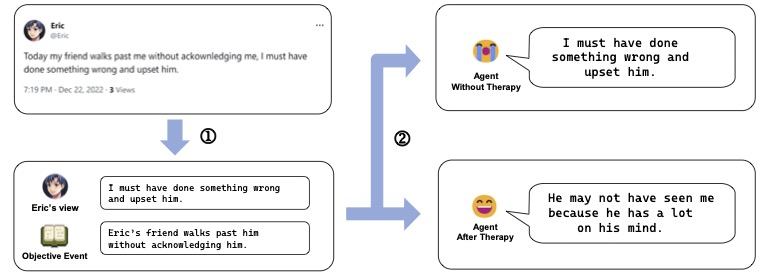
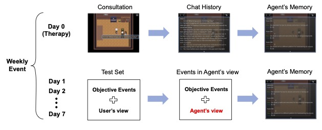

# PsyAgents: An Open-Source Psychotherapy Simulation Platform with Interactive Agents

With the advancement of Large Language Models, their application in psychotherapy has seen a significant increase. Despite this, most current research focuses on therapy enhancements, with limited attention to the simulation of patient agents or the establishment of a complete framework for psychotherapy simulation. To bridge this gap, we propose PsyAgents, a platform that enables users to conduct regular consultations with patient agents as doctor, or to select appropriate doctor agents for consultations as patient. Users can employ their own data to create patient agents. Inspired by the cognitive behavioral therapy, the platform extracts objective events from  users' data, which are then used as inputs to generate the agents' subjective interpretations. This method facilitates the evaluation of the agents' authenticity and the effectiveness of the therapy by comparing the interpretations between the agents and the real users. Furthermore, the platform is developed using the RPG Maker game engine, ensuring direct and user-friendly interactions.

## Evaluation Framework

## Psychotherapy Simulation Framework
: 